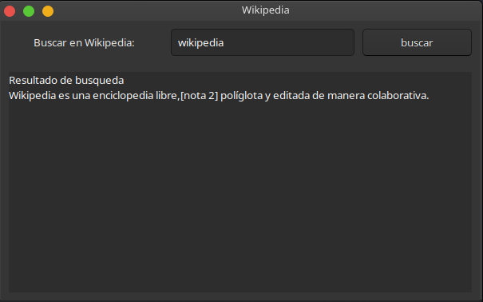

 # Buscador en wikipedia utilizando PyGObject
Aplicación sencilla en python utilizando la librería [PyGObject](hhttps://pygobject.readthedocs.io/) y también el modulo [wikipedia](https://pypi.org/project/wikipedia/).


## Instalación

- Windows
1. Vaya a http://www.msys2.org/ y descargue el instalador x86_64
2. Siga las instrucciones de la página para configurar el entorno básico
3. Ejecute C:\msys64\mingw64.exe - debería aparecer una ventana de terminal
4. Ejecutar pacman -Suy
4. Ejecute `pacman -S mingw-w64-x86_64-gtk3 mingw-w64-x86_64-python3 mingw-w64-x86_64-python3-gobject`
6. Para probar que GTK 3 funciona, puede ejecutar `gtk3-demo`
7. Copie el script hello.py que creó en `C:\msys64\home\<nombre de usuario>`
8. En la terminal mingw32, ejecute `python3 main.py` debería aparecer una ventana.

- Ubuntu / Debian
    - Instalación del sistema proporcionado PyGObject:
1. Abrir una terminal
2. Ejecute sudo apt install python3-gi python3-gi-cairo gir1.2-gtk-3.0
3. Cambie el directorio a donde se puede encontrar su secuencia de comandos `main.py` (por ejemplo, cd `cd Desktop`)
4. Ejecute python3  `main.py `

    - Para más información sobre la instalación de PyGObject, consulte la [documentación](https://pygobject.readthedocs.io/en/latest/getting_started.html).

> Por otro lado para instalar el modulo wikipedia, ejecute en su terminal de preferencia:
```bash
$ pip install wikipedia

```

## Screenshot


